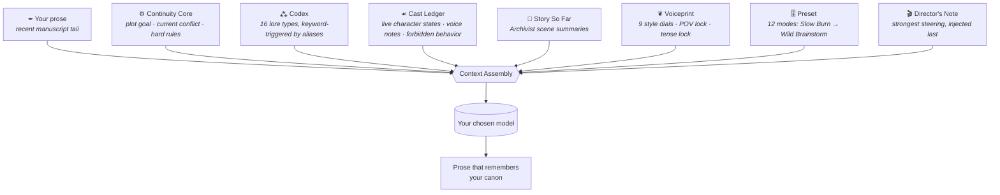

<div align="center">

# 🕯️ TomeForge Studio

### *The AI writing sandbox for stories that remember themselves.*


A fiction-first AI writing environment for **novelists, roleplayers, game writers, and worldbuilders** —
a style-matching co-writer, a persistent Story Brain, a 100-tool creative workshop, and an
interactive text-adventure engine. Not a chatbot with a manuscript window taped to its forehead.

**Everything stays in your browser. Your words, your keys, your canon.**

</div>

---

## ⚡ Quick start

```sh
npm install
npm run dev        # → http://localhost:5199
```

> **Windows:** just double-click **`start.bat`** (and `stop.bat` to shut down cleanly).

Then open **Settings** and connect a brain:

| Cloud (bring your key) | Local (no key at all) |
|---|---|
| Anthropic · OpenAI · OpenRouter · Groq · Mistral | **LM Studio** (`localhost:1234`) · **Ollama** (`localhost:11434`) |

Click **↻ Fetch models** to pull the live model list from whichever provider you pick.
Keys live only in your browser's localStorage and are sent only to the provider you chose.
A demo project — *The Drowned Observatory* — ships pre-loaded so every feature is explorable immediately.

---

## 🧠 The Story Brain

The part that makes it different. Every generation — every continuation, tool run, and GM turn —
is assembled from the project's living memory:



- **Canon Lock** — four modes from *Loose* (invent freely) to *Strict* (no new world facts, ever)
- **Continuity Check** — one click asks the AI to hunt contradictions: resurrected characters, forgotten injuries, broken timelines
- **The Archivist** — scans your manuscript for uncatalogued recurring names and offers one-click AI-drafted Codex entries; writes scene summaries that become long-range memory
- **Relationship Web** — an AI-woven, draggable force-graph of every bond, grudge, and secret in your cast
- **Threadmap** — a tiny goblin accountant for narrative promises: clues planted, questions raised, payoffs owed
- **Chronicle** — the timeline keeper for mysteries, epics, and anything with time travel

---

## 🗺️ The rooms of the workshop

| Room | What happens there |
|---|---|
| **✒ Manuscript** | The co-writing sandbox: **Continue · Extend · Fork ×3 · Rewrite-without-replacing**, ghost-text suggestions (`Ctrl+Space`, `Tab` to accept), Focus Mode with typewriter scrolling + **The Hearth** (synthesized fire/rain ambience), **Corkboard view** with draft/revising/final status colors, **Reading Mode** (your book, typeset), Prompt Peek, snapshot **diffs**, scene **trash & restore**, read-aloud, sprints, find & replace |
| **⁂ Story Brain** | Continuity Core · Codex · Cast Ledger · Threadmap · Chronicle · Archivist (name scanning, scene summaries & naming) · Continuity Check |
| **❝ The Parlor** | Sit down with anyone from your cast — they answer **in their own voice**, know only what they know, and guard their secrets. Interview, interrogate, or just listen; save transcripts to notes |
| **⚒ Forgebench** | **100 tools** across Idea, Plot, Character, Dialogue, World, Revision, Publishing — every one reads your Story Brain |
| **⚔ StoryQuest** | Text-adventure engine: 6 GM modes, 8 commands (*Do, Say, Think, Inspect, Use, Travel, Wait, Remember*), tracked world state (**hand-editable** when the GM forgets your sword), **timeline branches**, d20 rolls, convert-any-branch-to-prose |
| **❦ Voiceprint** | Style profiles: prose density, vocabulary, dialogue frequency, darkness, surrealism… plus POV and tense locks |
| **◍ Insights** | GitHub-style writing heatmap, streaks, daily goal ring with ember-burst, manuscript composition stats |
| **⇲ Import & Export** | EPUB **with generated cover art** · styled HTML · Markdown · RTF (Word) · plain text · Story Bible · full JSON backup/restore · **manuscript import** (.txt/.md → chapters & scenes) |
| **❖ SillyTavern** | A full ST studio: **lossless round-trip** import/edit/export of cards (V1/V2/V3, .json/.png — system prompt, greetings, creator credits all preserved) and lorebooks · a **card & worldbook editor** (entries, trigger keys, secondary AND-keys) · **✨ AI generators** that forge original cards and whole worldbooks from a prompt · the **Card Forge** (Cast Ledger → spec card with Codex lorebook) · Codex ⇄ World Info both ways · secondary-key matching parity inside TomeForge's own context engine |

Plus **✨ Inspire buttons** wherever a blank field stares back — new-tome ideas, quest premises, memory drafts, director's notes, voice descriptions.

<details>
<summary><b>🎭 All 100 Forgebench tools</b></summary>

| Category | Tools |
|---|---|
| **Idea** (14) | Premise Generator · What-If Engine · Story Seed · Title Generator · Logline Generator · Genre Mashup · Trope Inverter · Plot Twist · Ending Generator · Theme Finder · Opening Line Generator · Dramatic Question Engine · Constraint Forge · Comp Titles Finder |
| **Plot** (15) | Three-Act Builder · Save the Cat · Hero's Journey · Mystery Clue Map · Romance Arc · Villain Plan · Chapter Outline · Scene Cards · Reverse Outline · Plot Hole Detector · Midpoint Reversal · Subplot Weaver · Stakes Escalator · Chekhov Auditor · Ticking Clock |
| **Character** (14) | Character Generator · Arc Builder · Backstory · Motivation Mapper · Relationship Web · Voice Profile · Conflict Generator · Character Interview · Cast Balance Report · Foil Designer · Fatal Flaw Generator · Minor Character Spotlight · Name Forge · Secret Generator |
| **Dialogue** (13) | Conversation Generator · One-Liners · Subtext Enhancer · Argument Builder · Banter · Exposition Softener · Voice Consistency Check · Screenplay ⇄ Prose Converters · Dialect & Speech Pattern Designer · Interruption Pass · First Meeting Generator · Epistolary Composer |
| **World** (16) | Nation · City · Magic System · Technology · Religion · Creature · Artifact · Language Seed · Faction · Economy · Map Prompt · Cultural Conflict · Festival & Holiday · Cuisine & Food Culture · Legend & Folk Tale · Slang & Idiom |
| **Revision** (17) | Developmental Edit · Line Edit · Copy Edit · Tone Check · Pacing Report · Compression · Expansion · Show-Don't-Tell · Sensory Pass · Dialogue Tightening · Prose Polish · Readability · Chapter Summary · Echo Hunter · Opening Hook Audit · Cliffhanger Pass · Emotion Heatmap |
| **Publishing** (11) | Back-Cover Blurb · Query Letter · Synopsis · Character List · Series Bible · Ebook Metadata · Content Notes · Adaptation Pitch · Author Bio · Social Teaser Pack · Series Pitch Builder |

</details>

<details>
<summary><b>📥 SillyTavern import details</b></summary>

Drop `.json` or card `.png` files onto **Import & Export → Outside Worlds**:

- **Character cards** — V1 legacy, V2 (`chara_card_v2`), V3 (`chara_card_v3`), including data embedded in PNG `chara`/`ccv3` chunks → become Codex entries + Cast Ledger cards
- **Lorebooks / World Info** — both the spec `character_book` shape and SillyTavern's native format → become Codex entries; trigger keys become aliases so keyword-matched context injection keeps working exactly like ST
- `constant` entries become *always include*; disabled entries are skipped; greetings and chat prompts are deliberately ignored — TomeForge is a manuscript, not a chat

</details>

---

## ⌨️ Keyboard

| Keys | Does |
|---|---|
| `Ctrl` `K` | Command deck — jump anywhere, run any tool, search every scene, codex entry, and character |
| `Ctrl` `Space` | Ghost suggestion at the caret |
| `Tab` / `Esc` | Accept / dismiss the ghost |
| `Esc` | Exit Focus Mode |
| `Ctrl` `/` | Shortcut help |

---

## 🛡️ Principles

1. **Your draft is sacred.** Generations require an explicit *Accept*; rewrites require an explicit *Replace*; destructive AI actions snapshot the scene first. The original is never silently overwritten.
2. **Stays inside the fiction.** The system prompt forbids assistant chatter, lectures, and meta-commentary.
3. **Local-first.** No backend, no accounts, no telemetry. Words leave your machine only when *you* call your chosen AI provider. Full JSON backup gets everything out anytime.

## 🏗️ Stack

React 18 · TypeScript (strict) · Vite · zustand (immer + persist) · jszip (EPUB) — and **three themes**: Ink & Ember 🕯️, Parchment 📜, Abyss 🌊.

<div align="center">

*It is not here to replace the writer. It is here to hold the lantern while the writer walks deeper into the labyrinth.*

</div>
